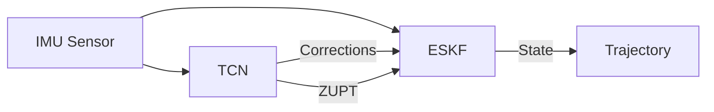

# Trajecto: AI-Enhanced 3D Pen Tracking


**Trajecto** is a centimeter-level 3D handwriting reconstruction system that fuses **Deep Learning (TCN)** with **Physics-Based Filtering (ESKF)**. It uses a single low-cost 6-axis IMU (BMI270) to track pen trajectories in real-time on an ESP32-S3 microcontroller.

## 🚀 Key Features

*   **Hybrid Architecture**: Combines an Error-State Kalman Filter (for physical consistency) with a Temporal Convolutional Network (for drift correction and ZUPT detection).
*   **Sim2Real Pipeline**: End-to-end workflow from PyTorch training to INT8 Quantized TFLite inference on embedded hardware.
*   **Precision Sync**: "Tap-Wait-Write" protocol achieves sub-millisecond synchronization between the IMU and ground-truth (iPad) data.
*   **Embedded First**: Optimized C++ firmware runs at 50Hz on ESP32-S3 with <30ms total latency.
*   **Advanced Training**: Features Dynamic Weight Averaging (DWA) and Context-Aware Loss balancing.

---

## 🧠 System Architecture

Trajecto uses a **Closed-Loop Error Correction** mechanism:

1.  **ESKF Backbone**: Integrating raw accelerometer and gyroscope data to estimate Position, Velocity, and Orientation.
2.  **TCN Observer**: Looking at a window of raw sensor data to predict:
    *   **Velocity Residuals**: Correcting the ESKF's velocity drift.
    *   **ZUPT Probability**: Detecting "Zero-Velocity" events (pen stops).
    *   **Measurement Noise**: Adaptively tuning the Kalman Filter's trust in sensor data.



---

## 🛠️ Setup & Installation

### Prerequisites
*   **Python 3.11+**
*   **uv** (Python package manager)
*   **ESP-IDF v5.0+** (for firmware)

### Installation
```bash
# Clone the repository
git clone https://github.com/your-username/trajecto.git
cd trajecto

# Install dependencies using uv
uv sync
source .venv/bin/activate
```

---

## ⚡ Workflow

### 1. Data Acquisition
Collect training data using the interactive CLI tool. This captures data from the ESP32 (via BLE) and the iPad (Ground Truth) simultaneously.

```bash
python utils/acquire.py
```

**⚠️ The "Tap-Wait-Write" Protocol**
Data **MUST** be collected with this specific sequence to ensure valid synchronization:
1.  **Tap 1**: Hard tap on the table (Start Sync).
2.  **Wait (2s)**: **CRITICAL**. Hold completely still for gravity alignment.
3.  **Write**: Perform the handwriting motion.
4.  **Wait (1s)**: Hold still.
5.  **Tap 2**: Hard tap on the table (End Sync).

### 2. Model Training
Train the hybrid ESKF-TCN model. The script automatically handles data loading, augmentation, and loss balancing.

```bash
python train_eskf.py --epochs 200 --batch-size 16
```

### 3. Validation
Evaluate the trained model against ground truth trajectories.

```bash
python validate.py --model_path checkpoints/best_model.pth
```

### 4. Deployment (Sim2Real)
Convert the trained PyTorch model to a C++ header file for the ESP32.

```bash
# 1. Export to ONNX and TFLite (Quantized)
python utils/convert_tflite.py --model_path checkpoints/best_model.pth

# 2. Deploy to Firmware
cd firmware
idf.py build flash monitor
```

---

## 📂 Project Structure

```
Trajecto/
├── model/                  # Core PyTorch Models
│   ├── ESKF_TCN.py         # Main Hybrid Model
│   ├── ESKF.py             # Differentiable Kalman Filter
│   ├── TCN.py              # Temporal Convolutional Network
│   └── config.py           # Configuration & Hyperparameters
├── train_eskf.py           # Main Training Script
├── firmware/               # ESP32 C++ Firmware
│   ├── main/               # Application Code
│   └── components/         # Embedded Libraries
├── utils/                  # Helper Scripts
│   ├── acquire.py          # Data Collection Tool
│   └── convert_tflite.py   # Model Deployment Pipeline
└── hardware/               # PCB Design Files
```

## 🔧 Hardware Specs

*   **MCU**: ESP32-S3-WROOM-1 (240MHz, Dual Core)
*   **IMU**: Bosch BMI270 (16-bit Accel/Gyro)
*   **Protocol**: Bluetooth Low Energy (BLE)
*   **Sampling Rate**: 50Hz (aligned)

## 📄 License

This project is licensed under the following terms:

*   **Software**: Licensed under the **Apache License 2.0**. See [LICENSE](LICENSE) for details.
*   **Hardware**: Licensed under the **CERN Open Hardware Licence Version 2 - Permissive (CERN-OHL-P)**. See [LICENSE_HARDWARE](LICENSE_HARDWARE) for details.