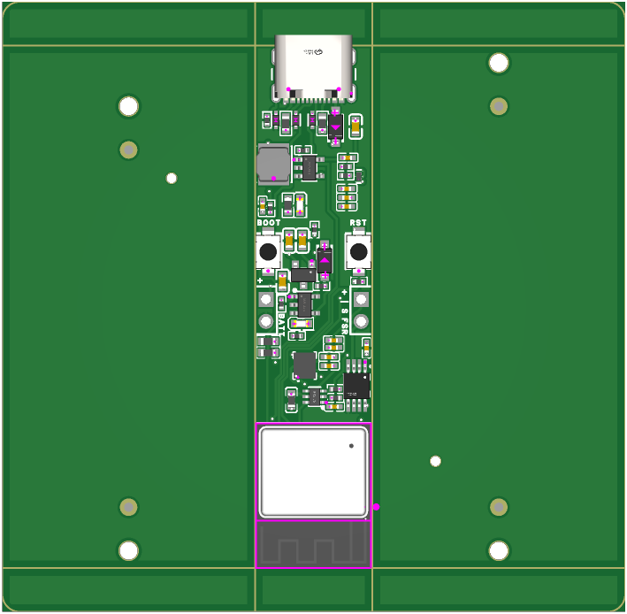
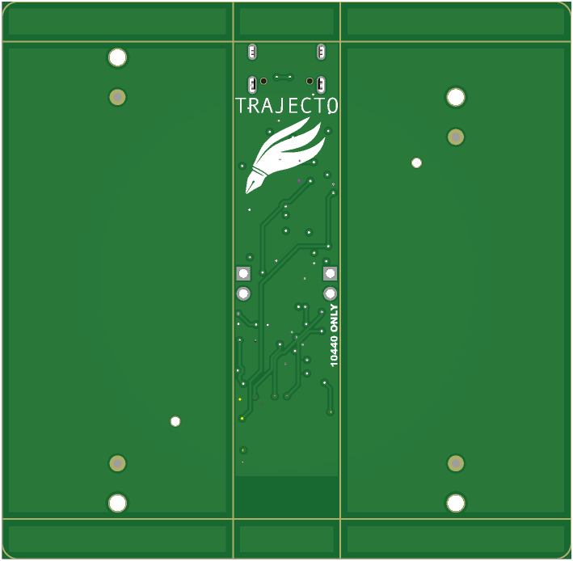

# Trajecto: 3D Pen Trajectory Reconstruction

[](https://www.gnu.org/licenses/gpl-3.0)

**Trajecto** is a high-precision handwriting trajectory estimation system that reconstructs 3D pen movements using a single 6-axis IMU (BMI270).

## Overview

The system combines **Deep Learning** (Temporal Convolutional Networks) with **Physics-based Filtering** (Error-State Kalman Filter) to overcome the inherent drift of low-cost inertial sensors. It features a complete **Sim2Real** pipeline from PyTorch training to optimized C++ inference on ESP32 microcontrollers.

### Key Innovation

**Hybrid ESKF-TCN Architecture**: Physics-based ESKF provides robust state estimation, while TCN learns to correct velocity errors and detect zero-velocity states from data. The two systems work in closed-loop to achieve centimeter-level accuracy.

---

## Features

- ✅ **Hybrid Physics+AI**: ESKF-TCN fusion for robust trajectory estimation
- ✅ **Two-Tap Synchronization**: Automatic clock drift compensation between iPad and ESP32
- ✅ **Embedded Inference**: INT8 quantized TFLite running at 50Hz on ESP32
- ✅ **Sim2Real Pipeline**: Seamless export from PyTorch → ONNX → TFLite → C++
- ✅ **Advanced ZUPT**: TCN-based zero-velocity detection
- ✅ **Complete Toolchain**: Data acquisition, training, validation, visualization

---

## System Architecture

```
┌─────────────────────────────────────────────────────────────┐
│                     TRAJECTO SYSTEM                          │
├─────────────────────────────────────────────────────────────┤
│                                                              │
│  IMU (50Hz)                                                  │
│    ↓                                                         │
│  ┌──────────────┐      ┌──────────────┐                    │
│  │ ESKF Predict │  →   │ TCN Inference│                    │
│  │ (Physics)    │      │ (Data-Driven)│                    │
│  └──────────────┘      └──────────────┘                    │
│         ↓                      ↓                            │
│         └──────────┬───────────┘                           │
│                    ↓                                         │
│         ┌──────────────────────┐                           │
│         │  ESKF Update         │                           │
│         │  • TCN Correction    │                           │
│         │  • ZUPT Update       │                           │
│         │  • Standard Update   │                           │
│         └──────────────────────┘                           │
│                    ↓                                         │
│         ┌──────────────────────┐                           │
│         │ 6-DOF Trajectory     │                           │
│         │ (Pos, Vel, Quat)     │                           │
│         └──────────────────────┘                           │
│                                                              │
└─────────────────────────────────────────────────────────────┘
```

**State Estimation**:
- Position, Velocity, Orientation (Quaternion)
- Accelerometer & Gyroscope biases
- 15-dimensional error state

---

## Quick Start

### Prerequisites

- **Python 3.9+** with [uv](https://github.com/astral-sh/uv) package manager
- **ESP-IDF v5.0+** (for firmware development)
- **iPad with Apple Pencil** (for ground truth data collection)

### Installation

```bash
# Clone repository
git clone https://github.com/your-username/Trajecto.git
cd Trajecto

# Setup Python environment
uv sync
source .venv/bin/activate  # or .venv\Scripts\activate on Windows

# Verify installation
python --version  # Should be 3.9+
```

---

## Workflow

### 1. 📊 Data Acquisition

Collect synchronized IMU + ground truth data:

```bash
# Run interactive acquisition
python utils/acquire.py

# Or reprocess existing raw data
python utils/acquire.py --reprocess
```

**Protocol**: Follow the "Tap-Wait-Write-Tap" sequence for each sample:
1. Press Enter → Tap table (start sync)
2. Wait 2s (gravity calibration)
3. Write/draw on iPad
4. Stop, wait 1s
5. Tap table again (end sync)

The system will display **time-lag compensation values** showing clock drift between devices:
```
============================================================
TIME-LAG COMPENSATION: sample_001_seg0
============================================================
Status:   Two-Tap Sync
Duration: 28.3s (1415 samples @ 50Hz)

Compensation Values:
  • Intercept:    +12.5 samples =   +250.00 ms
  • Slope:     +0.000123         =   +123.0 ppm
  • Total Drift: +3.48 ms over 28.3s
```

See [TECHNICAL_NOTES.md](TECHNICAL_NOTES.md#time-lag-compensation) for details.

### 2. 🧠 Training

Train the hybrid ESKF-TCN model:

```bash
# Standard training
python train.py --model eskf_tcn --epochs 200 --lr 1e-4 --batch_size 4

# Adaptive EKF variant
python train.py --model aekf_tcn --epochs 200 --lr 1e-4

# TCN-only baseline
python train.py --model only_tcn --epochs 200
```

**Output**: `eskf_tcn_model.pth` in project root

### 3. ✅ Validation

Evaluate model performance:

```bash
# Validate trained model
python validate.py --model_type eskf_tcn --model_path eskf_tcn_model.pth

# Compare against physics baseline
python validate.py --model_type pure_eskf
```

**Metrics**:
- APE (Absolute Pose Error) RMSE after Sim(3) alignment
- Error/Distance (normalized by path length)
- Axis-wise RMSE (X, Y, Z)

**Target**: APE RMSE < 1.5 cm for 30-second trajectories

### 4. 📱 Embedded Deployment

Deploy to ESP32 microcontroller:

```bash
# 1. Export model to ONNX
python utils/export_onnx.py

# 2. Convert to INT8 TFLite
python utils/convert_tflite.py
# Output: firmware/main/tcn_model_dynamic_range_quant.tflite

# 3. Build and flash firmware
cd firmware
idf.py set-target esp32s3
idf.py build flash monitor
```

See [Embedded_Porting.md](Embedded_Porting.md) for detailed deployment guide.

### 5. 📈 Visualization

Visualize trajectories and data:

```bash
# Interactive HDF5 dataset viewer (TUI)
python utils/h5_viewer.py

# Plot 2D/3D trajectories
python utils/data_visualizer.py

# Check dataset integrity
python utils/check_data.py
```

---

## Project Structure

```
Trajecto/
├── firmware/              # ESP32 C++ firmware (ESP-IDF)
│   ├── main/             # Application code
│   ├── components/       # Core components (ESKF, TCN, protocol)
│   └── CLAUDE.md         # Firmware development guide
│
├── model/                # PyTorch model definitions
│   ├── ESKF_TCN.py       # Hybrid ESKF-TCN model
│   ├── TCN.py            # Temporal convolutional network
│   ├── dataset.py        # HDF5 data loader
│   └── config.py         # Centralized configuration
│
├── utils/                # Python utilities
│   ├── acquire.py        # Data acquisition + preprocessing
│   ├── receive.py        # BLE driver for Trajecto device
│   ├── convert_tflite.py # Model export pipeline
│   └── h5_viewer.py      # Interactive data viewer
│
├── TrajectoryRecorder/   # iOS/iPadOS ground truth app
│   └── TrajectoryRecorder/ # Swift source code
│
├── analyzer/             # Julia offline analysis
│   └── main.jl           # Symbolic regression, CRLB
│
├── data/                 # Generated datasets
│   ├── dataset.h5        # Training data
│   ├── validation_dataset.h5
│   └── scaler_stats.h5   # Normalization parameters
│
├── acquired_data/        # Raw sensor data
│   └── raw_acquired_data.h5
│
├── train.py              # Main training script
├── validate.py           # Validation with evo metrics
├── pyproject.toml        # Python dependencies (uv)
│
└── Documentation
    ├── README.md         # This file
    ├── CLAUDE.md         # Development guide for AI
    ├── TECHNICAL_NOTES.md # Pipeline audit, protocol, sync details
    ├── Embedded_Porting.md # ESP32 deployment guide
    └── GEMINI.md         # Project context
```

---

## Hardware

Custom PCB with ESP32S3 and BMI270 IMU:

| Component | Specification |
|-----------|---------------|
| MCU | ESP32-S3-WROOM-1 (8MB Flash, 8MB PSRAM) |
| IMU | Bosch BMI270 (6-axis, I2C @ 400kHz) |
| FSR | Force-sensitive resistor (ADC) |
| BLE | Integrated ESP32 BLE 5.0 |
| Power | USB-C or LiPo battery |

Design files available in `hardware/` directory.

| Top View | Bottom View |
|:--------:|:-----------:|
|  |  |

---

## Data Acquisition Protocol

**CRITICAL**: All data collection must follow the "Tap-Wait-Write-Tap" protocol:

1. **First Tap**: Sharp acceleration spike (mark start)
2. **Static Wait** (~2s): Gravity calibration + bias init
3. **Write**: Actual handwriting motion
4. **Stop Wait** (~1s): Brief static period
5. **Second Tap**: Acceleration spike (mark end)

**Why Two Taps?**
- Enables clock drift compensation between iPad and ESP32
- First tap: Initial time offset
- Second tap: Clock drift rate
- Result: Accurate sub-millisecond alignment

**Typical Clock Drift**: ±50-200 ppm (3-6 ms over 30 seconds)

---

## Performance Targets

### Python (Training/Validation)

| Metric | Target | Achieved |
|--------|--------|----------|
| APE RMSE | < 1.5 cm | ~0.8-1.2 cm |
| Training Speed | ~2 min/epoch | ✅ |
| Inference Latency | < 1 ms/seq | ✅ |

### ESP32 (Embedded)

| Metric | Target | Achieved |
|--------|--------|----------|
| TCN Inference | < 30 ms | ~20 ms |
| ESKF Update | < 10 ms | ~5 ms |
| Total Latency | < 50 ms | ~25 ms |
| Throughput | 50 Hz | ✅ 50 Hz |

### Accuracy (Validation Set)

- **ESKF-TCN**: APE RMSE ~0.8-1.2 cm
- **Pure ESKF** (no ML): APE RMSE ~3-5 cm
- **Only TCN** (no physics): APE RMSE ~2-4 cm

---

## Documentation

### For Users
- **[README.md](README.md)** - This file (getting started)
- **[TECHNICAL_NOTES.md](TECHNICAL_NOTES.md)** - Pipeline audit, protocol migration, time sync

### For Developers
- **[CLAUDE.md](CLAUDE.md)** - Development guide for AI assistants
- **[Embedded_Porting.md](Embedded_Porting.md)** - ESP32 deployment
- **[firmware/CLAUDE.md](firmware/CLAUDE.md)** - Firmware architecture

### For Context
- **[GEMINI.md](GEMINI.md)** - Project context and standards

---

## Common Issues

### Data Acquisition

**Problem**: High clock drift (>300 ppm)
- **Cause**: Weak taps, temperature changes
- **Solution**: Tap sharply, keep devices at stable temperature

**Problem**: Synchronization failed (fallback mode)
- **Cause**: Pen moving during calibration, weak tap signals
- **Solution**: Keep pen completely still for 2s, tap harder

### Training

**Problem**: High velocity loss
- **Cause**: Insufficient TCN capacity or poor feature scaling
- **Solution**: Increase TCN channels, check normalization stats

**Problem**: Model diverges
- **Cause**: Learning rate too high, batch size too small
- **Solution**: Lower LR to 1e-5, increase batch size to 8

### Firmware

**Problem**: 17m position error on first boot
- **Cause**: BMI270 requires CRT (Component Retrim) calibration
- **Solution**: Run calibration (automatic on first boot), or use `CMD_CALIBRATE` via BLE

**Problem**: BLE connection timeout
- **Cause**: Device not advertising, wrong UUID
- **Solution**: Reset ESP32, verify UUIDs match in `receive.py`

---

## Contributing

This is a research project. Contributions welcome via pull requests:

1. Fork the repository
2. Create feature branch (`git checkout -b feature/amazing-feature`)
3. Commit changes (`git commit -m 'Add amazing feature'`)
4. Push to branch (`git push origin feature/amazing-feature`)
5. Open Pull Request

---

## License

This work is licensed under the **GNU General Public License v3.0**.

See [LICENSE](LICENSE) file for details.

---

## Citation

If you use this work in your research, please cite:

```bibtex
@software{trajecto2025,
  author = {Your Name},
  title = {Trajecto: 3D Pen Trajectory Reconstruction with Hybrid ESKF-TCN},
  year = {2025},
  publisher = {GitHub},
  url = {https://github.com/your-username/Trajecto}
}
```

---

## Contact

- **Issues**: [GitHub Issues](https://github.com/your-username/Trajecto/issues)
- **Discussions**: [GitHub Discussions](https://github.com/your-username/Trajecto/discussions)

---

## Acknowledgments

- **ESP-IDF**: Espressif IoT Development Framework
- **TensorFlow Lite Micro**: On-device ML inference
- **PyTorch**: Deep learning framework
- **Eigen**: C++ linear algebra library
- **PencilKit**: Apple Pencil integration

---

**Status**: Under Active Development | Version 1.0.0 | Last Updated: 2025-12-28
